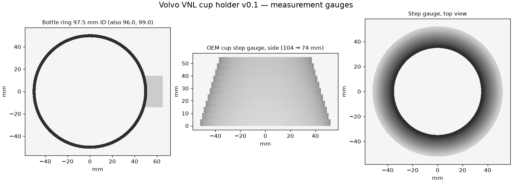

# v0.1 — measurement gauges

**These are measuring aids, not cup holder parts.** They answer two questions before the body is modeled:
how big the new cup must be for the YETI Rambler 36 oz (listed 3.75 in / 95.3 mm), and what shape the stock cup is inside.



## Print and test

Print at **100% scale**, flat as supplied, with no supports. PLA is fine.

1. **bottle_ring_96.0.stl, bottle_ring_97.5.stl, bottle_ring_99.0.stl** — 20 mm tall rings
   with their inside diameter engraved on the tab. Slide each one over the **bottom** of the Yeti,
   then up the body as far as the cup will reach (about 60–70 mm).
   Record the smallest ring that slides on and off easily without catching.
   That diameter, plus a little clearance, sets the new cup bore.
   96.0 should be snug on a 95.3 mm bottle and 99.0 loose. Aim for easy in and out with a little play,
   since the truck vibrates. If none fits, change `ring_id` and re-export.
2. **cup_step_gauge.stl** — a hollow stepped cone, **104 mm down to 74 mm in 3 mm steps**,
   each 5 mm tall. The notch marks step 0, the widest. Push the **narrow end** into the stock cup
   with the grey spring tongue held back. Record which step stops at the rim, and how far down
   the narrow end reaches. Repeat with the tongue released. This shows how tapered the stock cup is,
   so the clone can copy its shape while enlarging it.

| Step | Diameter (mm) | Height from wide base (mm) |
|---:|---:|---:|
| 0 | 104 | 0–5 |
| 1 | 101 | 5–10 |
| 2 | 98 | 10–15 |
| 3 | 95 | 15–20 |
| 4 | 92 | 20–25 |
| 5 | 89 | 25–30 |
| 6 | 86 | 30–35 |
| 7 | 83 | 35–40 |
| 8 | 80 | 40–45 |
| 9 | 77 | 45–50 |
| 10 | 74 | 50–55 |

## Reproduce

```sh
python export_models.py    # needs OpenSCAD
python validate_meshes.py  # needs NumPy; writes mesh_checks.json
python make_preview.py     # needs Matplotlib; writes preview.png
```

`mesh_checks.json` records closed oriented edges, triangle validity, one connected body and
bed/Z bounds. It does not certify fit.
