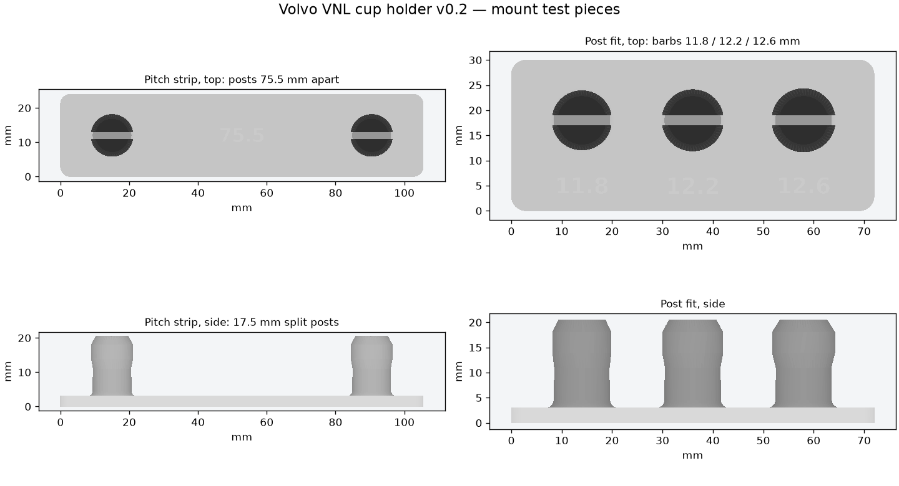

# v0.2 — mount test pieces

**Small test prints for the snap posts only. No cup holder body or clip yet.**

> **Hold off printing:** the 17.5 mm used for `post_h` turned out to be an orange-clip measurement,
> not the post height. Measure the stock post height (flange face to tip) and the barb diameter,
> then `post_h` gets updated and the STLs re-exported.
They check that the clone's posts fit the holes under the dash ledge before the full body is modeled.



## Owner measurements used (2026-09-29)

| Feature | Value | In the CAD |
|---|---:|---|
| Ledge hole diameter | 11.5 mm | Shank 11.1 mm (0.4 mm clearance); barb 11.8–12.6 mm |
| Post spacing, center to center | 75.5 mm | Pitch strip posts 75.5 mm apart |
| Ledge thickness | 20 mm | Posts don't pass through; they grip inside the hole |
| Post length | **unknown** | `post_h` is 17.5 mm, which is **wrong**: 17.6 mm is the orange clip's end (see below) |

The 17.6 and 23.9 mm readings are the **orange clip**: 17.6 mm across its end tab
([photo](../../../pictures/clip_end_17_6mm.jpg)) and 23.9 mm across the square-socket end
([photo](../../../pictures/clip_socket_width_23_9mm.jpg)). The stock post height is still needed.

## Print and test

Print at **100% scale**, plate flat on the bed with the posts up, no supports. PETG or PLA is fine for a test.

1. **post_fit.stl**: three single posts with barbs of **11.8, 12.2 and 12.6 mm** (engraved beside each).
   Push each post into one ledge hole. Pick the smallest barb that snaps in firmly, stays put when you tug,
   and can still be pulled out without breaking. If all are loose, the barb needs to be bigger; if all are too
   tight to push in, smaller. Change `fit_barbs` and re-export.
2. **pitch_strip.stl**: two posts **75.5 mm** apart with the 12.2 mm barb. Push both into two holes at once.
   They should drop in square, with no forcing sideways. If they bind, the spacing is off; note which way.

Each post is split by a 2.2 mm slot so the two halves squeeze together going in. The barb has a lead-in taper
at the tip and a back-taper below it.

## Reproduce

```sh
python export_models.py    # needs OpenSCAD
python validate_meshes.py  # needs NumPy; writes mesh_checks.json
python make_preview.py     # needs Matplotlib; writes preview.png
```

`mesh_checks.json` records closed oriented edges, triangle validity, one connected body and bed/Z bounds.
It does not certify fit or snap strength.
